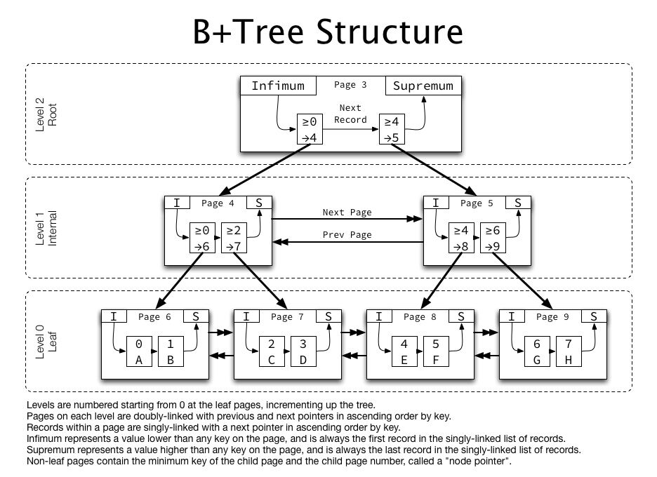
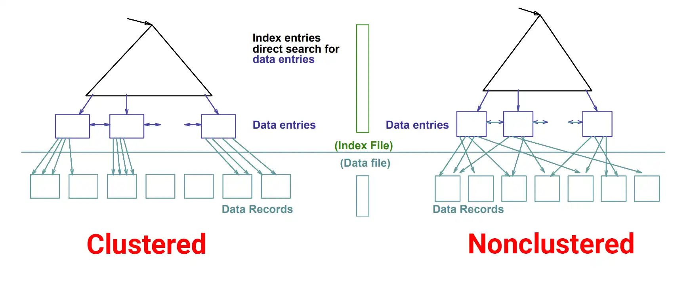

## 0. 용어 정리

- 페이지: 디스크와 메모리에 데이터를 읽고 쓰는 최소 작업 단위
- 카디널리티: 특정 컬럼의 유니크한 값의 개수를 의미하며, 카디널리티가 높을수록 선택도가 좋다고 표현

## 1. 인덱스란

- 데이터베이스에서 디스크 I/O를 줄여, 데이터 검색 작업 속도를 향상 시키기 위해 사용하는 자료구조
- 인덱스 자료구조를 위해서 B+Tree를 주로 사용함

### 1.1 인덱스에서 사용하는 자료구조

- 인덱스에서는 대표적으로 B-Tree기반의 자료구조와, Hash기반 자료구조를 사용

```
Hash 자료구조 기반 인덱스는 컬럼의 값으로 해시 값을 계산해서 인덱싱하는 알고리즘으로, 빠른 검색 B-Tree 기반보다 빠른 검색 속도를 제공하지만, 원본 값 자체를 인덱스로 저장하는 것이 아닌 해시값을 사용하므로 범위 검색 (Range Sacan)을 하지 못한다는 단점이 있음
```

#### 1.1.1 B-Tree 특징

B-Tree란 이진 탐색 트리(Binary Search Tree)를 일반화한 자료구조로,

- `N개의 자식노드`
  - 하나의 노드가 2개 이상의 자식을 가질 수 있어 분기 계수(Branching Factor)가 높은 것이 특징
- `균형 트리 (Balanceed Tree)`
  - 루트 노드에서부터 모든 리프 노트까지의 경로 길이가 항상 동일 => 어떤 값을 검색하더라도 항상 균일한 성능 보장 O(logN)
- `데이터는 모든 노드에 저장 가능`
  - 키와 해당하는 데이터 (or 데이터 주소)가 루트, 중간, 리프 노드 등 모든 종류의 노드에 저장될 수 있음

#### 1.1.2 B+Tree 특징



- `N개의 자식노드`
  - 하나의 노드가 2개 이상의 자식을 가질 수 있어 분기 계수(Branching Factor)가 높은 것이 특징
- `균형 트리 (Balanceed Tree)`
  - 루트 노드에서부터 모든 리프 노트까지의 경로 길이가 항상 동일 => 어떤 값을 검색하더라도 항상 균일한 성능 보장 O(logN)
- `데이터는 오직 리프노드에만 저장`
  - 중간 노드에 데이터 공간이 필요 없어지므로, 하나의 노드에 더 많은 키를 저장할 수 있게됨 => 트리으 높이를 낮추는 효과
- `리프 노드 간의 연결`
  - 모든 리프 노드들이 양방향 연결 리스트로 서로 연결되어있음
  - 단일 검색 (`=`) 뿐만 아니라 범위 검색 (`>`, `<`)에 유리
    - 시작점을 찾은 후에 리프 노드의 연결 리스트를 따라 순차적으로 데이터를 모두 읽을 수 있으므로 B-Tree에 비해 효율적

```
사진에서는 Level 0 계층에서 뿐만 이나라, 다른 계층에서도 각 페이지들이 양방향 연결 리스트로 구성되어있는데 이는 B+Tree의 일반적인 요구사항이 아님. B+Tree는 Level 0 에서만 페이지간 양방향 연결 리스트로 연결 되어 있으면 됨.

근데 왜 저런 구조가 나타나게 되었는가 ??
저것은 중간 노드에서의 연결로 볼 수 있는데, 데이터 검색이 아닌 인덱스 구조 변경(페이지 분할 및 병합)의 효율성을 높이기 위한 최적화 기법임

페이지 분할(Page Split) 시: 중간 노드가 꽉 차서 분할될 때, 주변 형제 노드들의 정보를 쉽게 파악하고 포인터를 재조정하기 위해 사용될 수 있음

페이지 병합(Page Merge) 시: 데이터 삭제로 인해 노드가 비었을 때, 형제 노드와 병합하는 과정에서 포인터가 있으면 더 효율적으로 처리할 수 있음.
```

### 1.2 인덱스의 단점

- 쓰기 성능 저하
  - B-Tree 인덱스의 정렬 상태를 유지하기 위한 추가 작업이 필요하므로, INSERT, DELETE, UPDATE시 추가 작업 발생
    - `INSERT`
      - 새로운 데이터가 인덱스 페이지에 삽임
      - 데이터가 들어갈 페이지가 꽉 차있다면, DBMS는 해당 페이지를 두 개로 분할. 이때 새로운 페이지를 할당하고 기존 데이터으 일부를 옮기는 작업이 발생하며, 이는 I/O 작업 유발
    - `DELETE`
      - 인덱스 페이지에서 키를 찾아 삭제
    - `UPDATE` (가장 최악)
      - 인덱스 컬럼이 아닌 값 변경: 인덱스와 관련이 없는 컬럼 값이 변경되었으므로, 인덱스에는 영향이 거의 없음
      - 인덱스 컬럼 값 변경: 내부적으로 기존 키를 `DELETE`하고 새로운 키를 `INSERT` 하는 것과 동일한 작업. 즉, 삭제와 삽입 비용이 모두 발생
- 추가 저장 공간 필요
  - 인덱스는 데이터 원본과는 별개의 물리적인 공간을 차지 (약 테이블의 10%라고 인터넷에 알려져 있지만 부정확)
  - 테이블의 인덱스 개수와 컬럼 구성에 따라, 데이터 자체보다 인덱스가 차지하는 공간이 더 커질 수 있음

## 2. 인덱스의 종류

### 2.1 클러스터드 인덱스 vs 논-클러스터드 인덱스



`클러스터드 인덱스`

- 테이블의 데이터 페이지가 인덱스의 키 순서에 따라 물리적으로 정렬된 형태
- 인덱스의 리프 페이지가 곧 실제 레코드를 담고 있음
- 한 테이블에 하나의 클러스터드 인덱스만 생성할 수 있음

`논-클러스터드 인덱스`

- 리프 노드에는 실제 데이터가 아닌, 행 주소 (Row Locater)가 담기며, 행주소는 정렬되지 않은 형태임 (인덱스 페이지는 정렬되어 있지만, 인덱스의 리프 페이지가 가리키는 원본 데이터 페이지는 정렬과 무관)
- 한 테이블에 N개의 논-클러스터드 인덱스를 생성할 수 있음

| 구분             | 클러스터드 인덱스 (Clustered)                                                             | 논-클러스터드 인덱스 (Non-clustered)                                                |
| ---------------- | ----------------------------------------------------------------------------------------- | ----------------------------------------------------------------------------------- |
| 데이터 저장 방식 | 테이블 **데이터 행 자체**가 인덱스 키 순서대로 **물리적으로 정렬**됨                      | 인덱스는 **키 값 + 행 포인터(Row Locator)** 만 보유, 실제 데이터는 별도 페이지 위치 |
| 개수 제한        | 한 테이블당 **1개** (주로 Primary Key)                                                    | **여러 개** 생성 가능                                                               |
| 주요 열(Columns) | 주로 **Primary Key** 컬럼                                                                 | 쿼리에서 자주 사용하는 컬럼 혹은 컬럼 집합                                          |
| 성능 특징        | • 범위 조회·순차 읽기 우수 <br> • 추가 정렬 비용 감소                                     | • 소량 결과·특정 값 조회 빠름 <br> • 다양한 질의 패턴 지원                          |
| 인덱스 크기      | 데이터 행 포함 → **크기 큼**                                                              | 키 + 포인터만 포함 → **작음**                                                       |
| 유지-관리        | • INSERT/UPDATE/DELETE 시 행 이동 가능성 <br> • 조각화(fragmentation) 발생 시 재구성 필요 | • 인덱스 갱신 부담 <br> • 다수 인덱스 → 유지보수 비용                               |
| 전형적 사용 사례 | 범위 기반 쿼리, 순차 I/O                                                                  | 등가 검색, ORDER BY / GROUP BY 보조                                                 |
| 장점(Pros)       | • 대용량 연속 데이터 빠른 검색 <br> • 트리 탐색 후 곧바로 데이터 접근(O(log N))           | • **다중 인덱스**로 다양한 쿼리 최적화 <br> • 적은 페이지 읽기로 특정 행 탐색       |
| 단점(Cons)       | • 클러스터 키 변경 시 **행 재배치** 비용 <br> • 랜덤 키 삽입 시 페이지 분할               | • 저장 공간 증가 <br> • 쓰기 성능 저하, 잘못된 인덱스 선택 위험                     |

> **Bookmark(또는 Key) Lookup**: 논-클러스터드 인덱스가 찾은 행 주소를 이용해 테이블(또는 클러스터드 인덱스)로 한 번 더 접근하는 과정.

## 3. 인덱스를 활용시 주의사항

- 인덱스를 사용하는 목적은 DB에서 데이터를 읽는 시간을 줄이기 위함인데 항상 인덱스를 사용하는 것이 항상 효율적인 것은 아님.
- 하지만 레코드 1건을 Index Scan 하는 것과 Table Scan 하는 시간 비용을 따져봤을떄, Index Scan 비용이 4 ~ 5 배 정도 비쌈 => 테이블의 전체 레코드를 20% ~ 25% 정도 이상을 요구하는 작업 이라면 Index Scan 보다는 Tablel Full Scan이 더 효율적임 (대개 DBMS의 옵티마이저가 알아서 판단 해줌)

  - 테이블 스캔은 저렴한 순차 I/O로 동작하고, 인덱스를 통한 읽기는 비싼 랜덤 I/O를 여러 번 수행하기 때문

    ```
    인덱스의 비싼 랜덤 I/O

    - B+Tree 인덱스의 루트 노드, 중간 노드, 리프 노드를 찾아가는 과정 자체가 디스크의 다른 위치들을 오가는 작업 (랜덤 I/O)
    - 리프 노드에서 찾은 주소로 실제 테이블 데이터 페이지에 접근하는 것도 또 다른 랜덤 I/O
    ```

## 4. 추가 공부사항

- 복합 인덱스
- 커버링 인덱스
- 실행계획을 통한 SQL 최적화 방법
